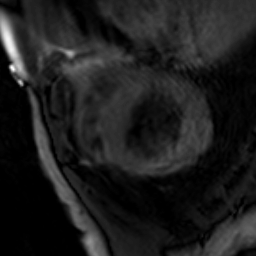
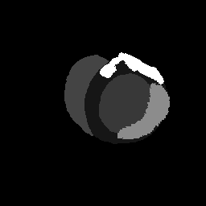
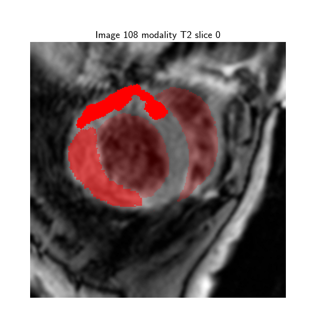

# Myocardial pathology segmentation combining multi-sequence CMR

**Dataset:** The “input" contains  45 cases of multi-sequence CMR. Each case refers to a patient with three sequence CMR, i.e., LGE, T2 and bSSFP CMR.
The “masks” folder contains 45 cases of multi-sequence CMR, where each mask represents the segmentation map of the the corresponding CMR Slice image (e.g image: _myops_training_108_CO_0.png_ mask:_myops_training_108_C0_gd_0.png_ ). 

* Label 1: normal myocardium
* Label 2: edema
* Label 3: scar
* Label 0: Background

**Dataloader:**
The data loader can be set to use online augmentation in order to overcome the limited data and overfitting problems. The augmentation is done with albumentation library and can include: 

* _Rotation_: one from Rotate, VerticalFlip, HorizontalFlip, RandomRotate90, Transpose or   ShiftScaleRotate
* _Cropping_: CenterCrop or RandomCrop
* _Contrast Enhancement_: RandomBrightnessContrast, RandomGamma  or CLAHE (Contrast Limited Adaptive Histogram Equalization)
* _Noise Addtion_:  Gaussian Noise
* _Distrorsion_: GridDistortion or Elastic Transform
* _Blurring_: One from Blur, MotionBlur or GaussianBlur

An Example of augmented Image and overlayed mask can be seen here: 

How to train the model:
_To train the model, please run the following command, you can change the parameters within the train.py file._

    python -u src\trainer.py -nc 3 -e 150
    
    *** Default training parameteres ***
    parser.add_argument("-lr", help="set the learning rate for the unet", type=float, default=0.0001)
    parser.add_argument("-e", "--epochs", help="the number of epochs to train", type=int, default=300)
    parser.add_argument("-gn", "--gaussianNoise", help="whether to apply gaussian noise", action="store_true",
                        default=True)
    parser.add_argument("-gpu",  help="Det the device to use the GPU", type=bool, default=False)
    parser.add_argument("--n_samples", help="number of samples to train", type=int, default=100)
    parser.add_argument("-bs", "--batch_size", help="batch size of training", type=int, default=4)
    parser.add_argument("-nc", "--n_class", help="number of classes to segment", type=int, default=3)
    parser.add_argument("-nf", "--n_filter", help="number of initial filters for Unet", type=int, default=32)
    parser.add_argument("-nb", "--n_block", help="number unet blocks", type=int, default=4)
    parser.add_argument("-pt", "--pretrained", help="whether to train from scratch or resume", action="store_true",
                        default=False)
                        

### Additionally, please answer the following questions about your code:

* __What, if anything, did you do to verify that the segmentation masks and images were correctly aligned in the data loader?__
  * You could easily check the image dimension after plotting the first set of images to verify if they are aligned or not.
     * Debug manually step by step to check dimensions and range 
     * Intermediate plotting of the results.

* __What assumptions did you make about the data or model training during this process?__
  * 
